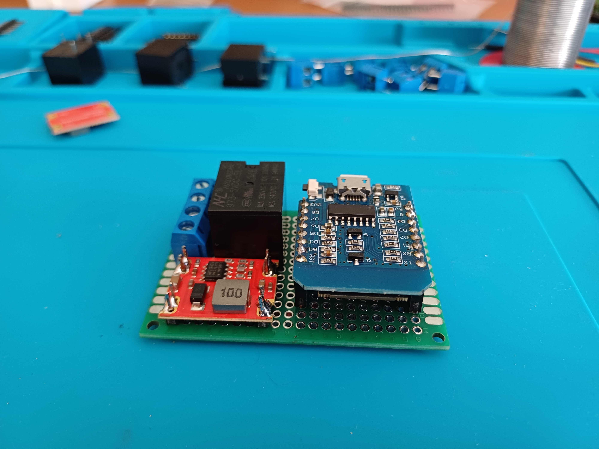
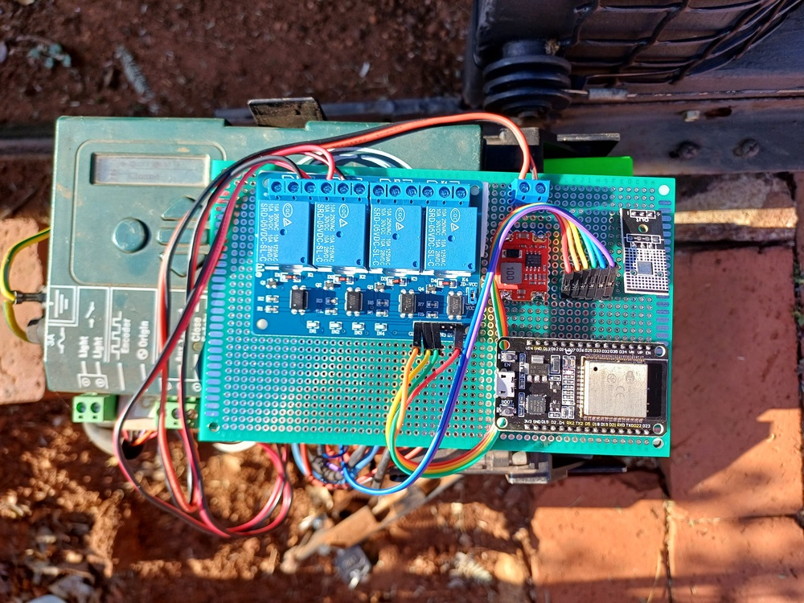
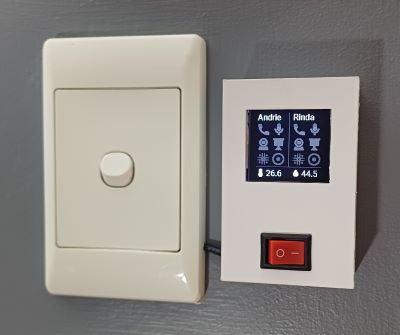
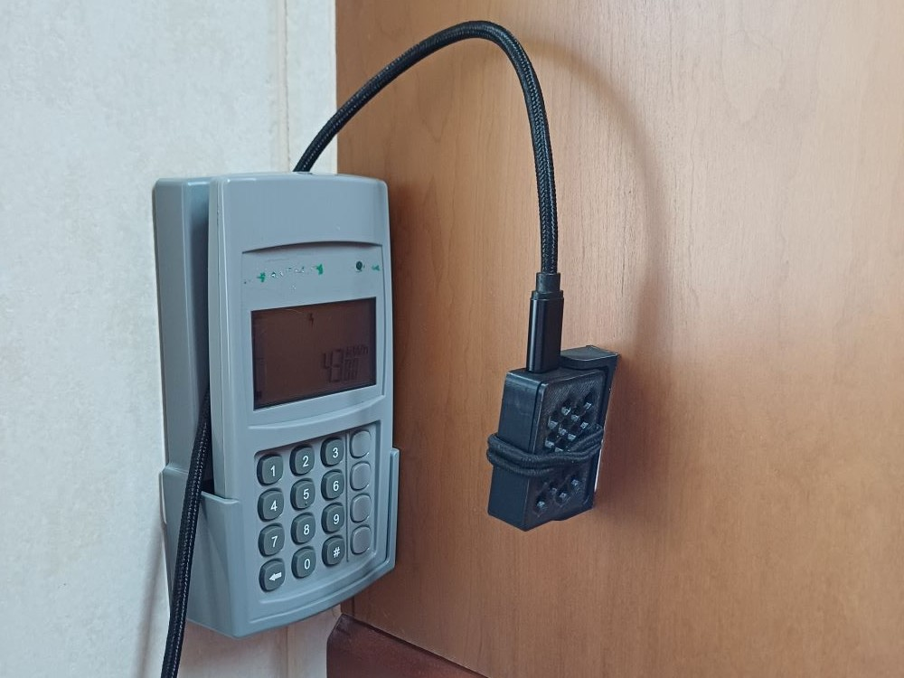

# ESP Home

Projects built with [ESP Home](https://esphome.io/).

## Garage Door Controller

A simple relay controller.

* Control the garage door motor (open, close).
* Read the door position using magnetic sensors.
* Pulls power from the motor controller using DC-DC buck converter.

[More detail and photos...](https://github.com/MrPrisoner/esphome-devices/tree/main/source/garage-door)

## Gate Motor Controller

Built for a Centurion D5 Evo controller.

* Control the gate motor (open, close).
* Engage the gate lock.
* Read and interpret the status LED.
* Simulate LED timings when connecting the sim pin to the status led pin.
* Includes a temperature sensor because that box gets hot!

[More detail and photos...](https://github.com/MrPrisoner/esphome-devices/tree/main/source/gate-controller)

## Water Tank Level Sensor

Measure the water level inside a tank using an ultrasonic distance sensor.

* Measure the distance from the top of the tank to the water level.
* Calculate the height of the water level from the ground.
* Calculate how full the tank is.
* Note that this sensor is installed in 2 connected tanks, thus the calculations are adjusted accordingly.

[More detail and photos...](https://github.com/MrPrisoner/esphome-devices/tree/main/source/water-tank)

## Teams Status Display

Displays Teams meeting status indicators.

* Indicates the Teams meeting status of 2 people (me and the wife).
* Uses sensors from Home Assistant, populated by [teams-status-rs](https://github.com/AntoineGS/teams-status-rs).
* Includes a temperature/humidity sensor.
* Wall mounted 3D case, designed and printed by Derrick.

[More detail and photos...](https://github.com/MrPrisoner/esphome-devices/tree/main/source/display-teams)

## Prepaid Meter Reader

Reads the remaining balance from a prepaid electricity meter's LCD screen.

Still a work in progress...

* Captures a photo of the prepaid meter.
* Uses a Home Assistant script to process the image using Seven Segments OCR.
* Uses a template sensor to provide the reading.
* Wall mounted 3D case, designed and printed by Derrick.

[More detail and photos...](https://github.com/MrPrisoner/esphome-devices/tree/main/source/prepaid-meter-camera)
