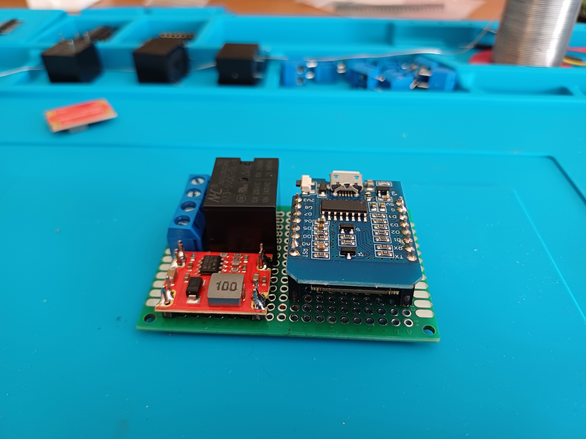

# Garage Door Controller

Monitors and controls any garage door motor using a relay and magnetic sensors.

## Features

* Controls the garage door motor (open, close).
* Reads the door position using magnetic sensors.
* Pulls power from the motor controller using DC-DC buck converter.

## Components used

* ESP8266 Wemos Mini D1 development board
* DC-DC Step-Down Buck Module (8-28V to 5V)
* 3V Relay module
* 2x Magnetic door switches
* Small prototype board

## Photos

