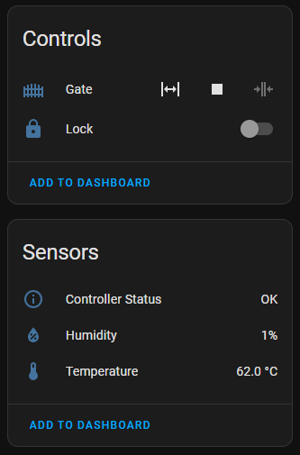

# Gate Motor Controller

Built for a Centurion D5 Evo controller. Adapted from [wernerhp's implementation](https://github.com/wernerhp/esphome/tree/main/centurion-d5-evo).

Features:

* Control the gate motor (open, close).
* Engage the gate lock.
* Read and interpret the status LED (opening, closing, problems).
* Simulate LED timings when connecting the sim pin to the status led pin.
* Includes a temperature sensor because that box gets hot!

Components used:

* ESP32 development board
* DC-DC Step-Down Buck Module (8-28V to 5V)
* 2x 5V Relay modules
* Dallas temperature sensor module
* Prototype board

