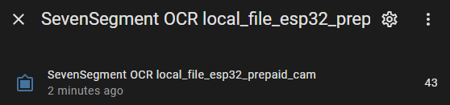
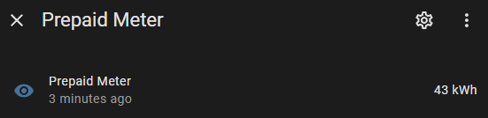
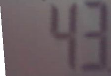
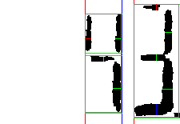
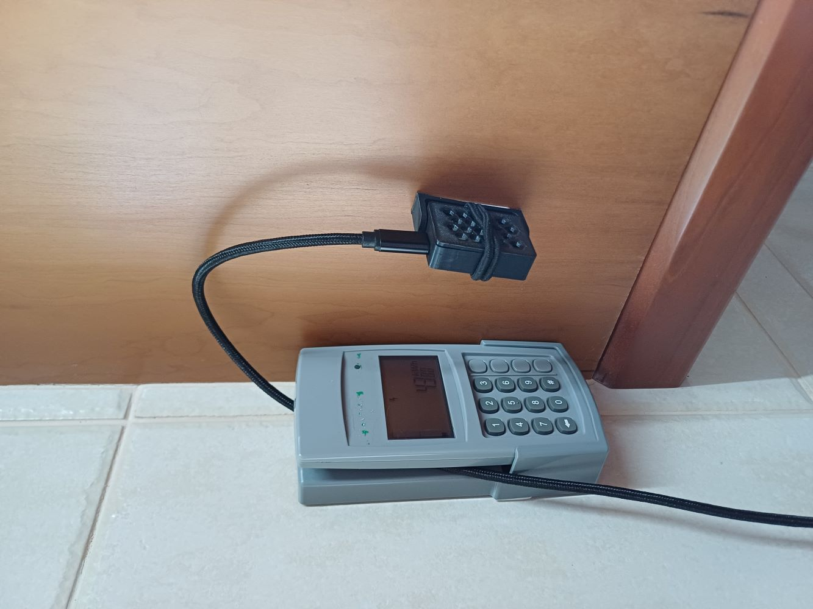
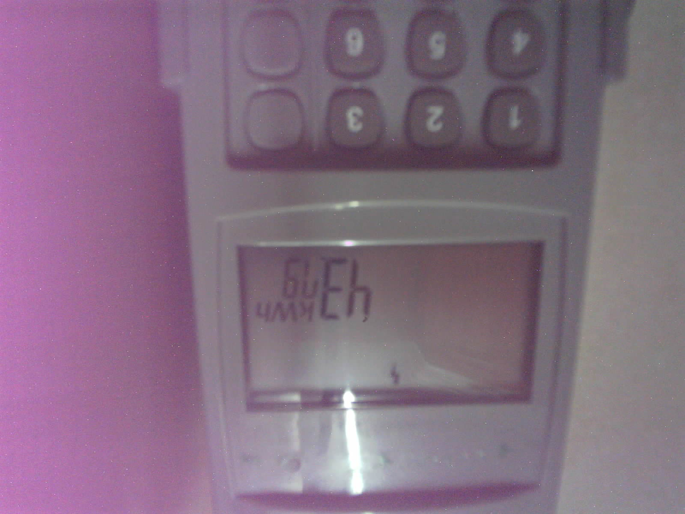

# Prepaid Meter Reader

Takes a photo of the prepaid meter LCD screen and processes the reading using OCR.





## Features

* Captures a photo of the prepaid meter.
* Uses a Home Assistant script to process the image.
* Uses a template sensor to provide the reading.

## Components used:

* ESP32-CAM with OV5640 camera
* USB power supply
* Wall mounted 3D case, designed and printed by Derrick.

## Notes

The OV5640 camera gets very hot within 1 minute of operation. To compensate I do this:

1. On boot, wait for Home Assistant API to become available.
1. Call a Home Assistant automation script.
1. The script takes a camera snapshot and saves it to file.
1. The ESP module will enter deep sleep for 1 hour, then repeat this process.

## Home Assistant setup

The flow in Home Assistant:

1. Automation script called from ESP32-CAM.
2. Take snapshot and save to file.
3. File exposed as [Local File](https://www.home-assistant.io/integrations/local_file) entity.
4. [Seven Segments OCR](https://www.home-assistant.io/integrations/seven_segments) reads and processes the file.
5. A [template sensor](https://www.home-assistant.io/integrations/template) exposes the value with the correct unit of measurement and other metadata.

### Automation Script

The camera is mounted in a room with a light I can control. The delays ensure the camera has grabbed a couple frames with the light on.

```yaml
  # turn on light
  # delay 5s
  - action: camera.snapshot
    metadata: {}
    data:
      filename: /media/esp32-prepaid-cam.jpg
    target:
      entity_id: camera.esp32_prepaid_cam_camera
  # delay 5s
  # turn off light
```

### Seven Segments OCR

I installed [SSOCR](https://www.unix-ag.uni-kl.de/~auerswal/ssocr/) on my Raspberry Pi and played with the different parameters until I found parameters that work okay-ish...

```cmd
./ssocr crop 718 586 225 155 rotate 180 shear 12 -P -D -d 2-3 -t 6 -o processed.jpg cam-snapshot.jpg
```

Take note of the order of the parameters – the Home Assistant SSOCR integration implements a specific order, e.g. first crop, then rotate. This affects the x/y position of the cropped area.

Using my snapshot (see photos section) yields the following results:




### Seven Segments OCR integration

Configuration for the SSOCR integration in `configuration.yaml`:

```yaml
image_processing:
  - platform: seven_segments
    rotate: 180
    x_position: 718
    y_position: 586
    width: 225
    height: 155
    threshold: 6
    extra_arguments: '-D shear 12 -o processed.jpg'
    source:
      - entity_id: camera.local_file_esp32_prepaid_cam
```

### Template sensor

The template sensor exposes the value with the correct unit of measurement and other metadata to be used in dashboards and automations.

```yaml
sensor:
  - platform: template
    sensors:
      power_meter:
        value_template: "{{ states('image_processing.sevensegment_ocr_local_file_esp32_prepaid_cam') }}"
        friendly_name: "Prepaid Meter Balance"
        unit_of_measurement: "kWh"
```

## Photos



