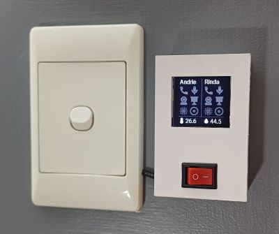

# Teams Monitor

Displays Teams meeting status indicators.

## Features

* Indicates the Teams meeting status of 2 people (me and the wife).
* Uses sensors from Home Assistant, populated by [teams-status-rs])(https://github.com/AntoineGS/teams-status-rs).
* Includes a temperature/humidity sensor.
* Wall mounted 3D case, designed and printed by Derrick.
* Pulls power from light switch.

## Components used:

* ESP32 S2 mini (ESP32-S2FN4R2)
* DHT22 temperature sensor module
* OLED 128x128 display
* Prototype board
* AC-DC Power Supply (240VAC to 5VDC)
* AC Switch
* Terminals for power connections

## Photos

