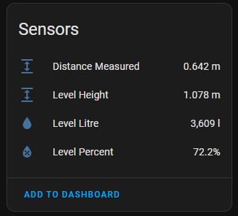
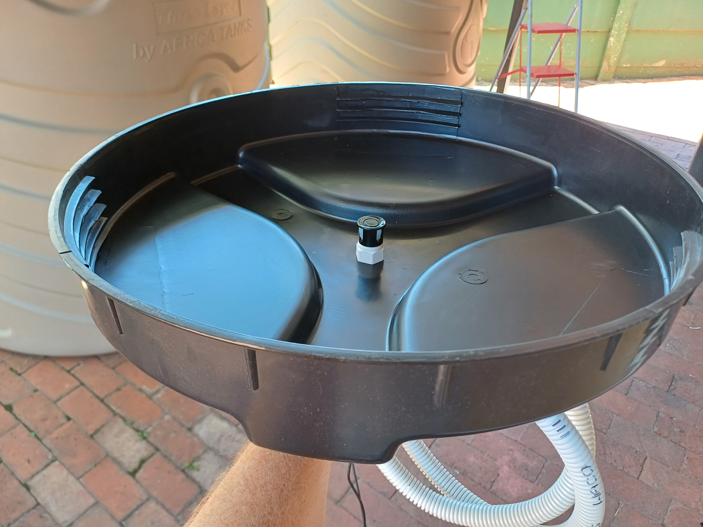
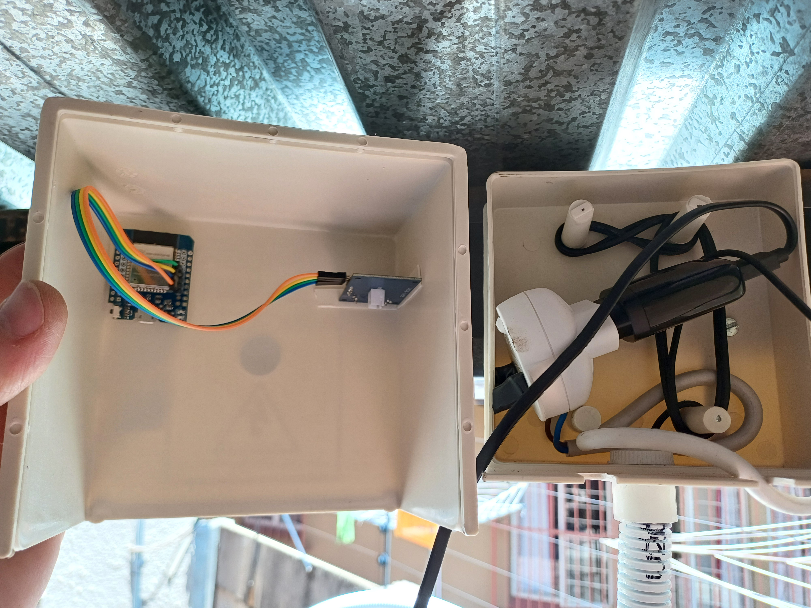

# Water Tank Level Sensor

Measures the water level inside a tank using an ultrasonic distance sensor.

## Features

* Measure the distance from the top of the tank to the water level.
* Calculate the height of the water level from the ground.
* Calculate how full the tank is.
* Note that this sensor is installed in 2 connected tanks, thus the calculations are adjusted accordingly.

## Components used

* ESP32 Wemos Mini D1 development board.
* Waterproof ultrasonic distance sensor module.
* Old phone charger for power because I forgot to think of a proper power supply.

## Photos

